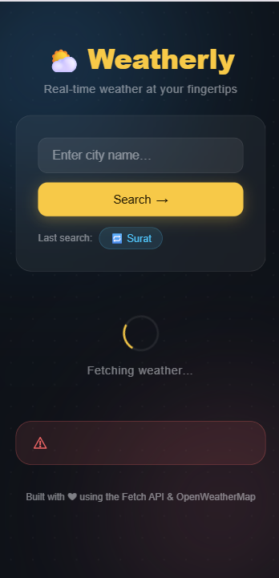
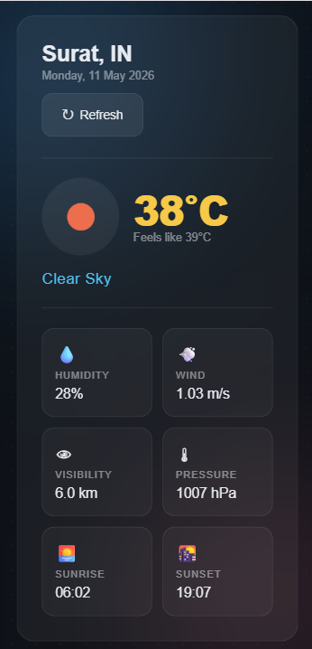

# 🌦️ API Integration Dashboard

A beginner-friendly weather dashboard that fetches real-time weather data using the OpenWeatherMap API — built with pure HTML, CSS, and Vanilla JavaScript.

---

## 📌 Project Overview

**API Integration Dashboard** is a responsive weather application developed as part of a frontend learning project. It demonstrates real-world API consumption using the Fetch API with modern JavaScript patterns like Async/Await.

The project focuses on:
- Consuming a third-party REST API (OpenWeatherMap)
- Handling asynchronous operations cleanly
- Modular JavaScript architecture for maintainability
- Graceful error handling for invalid inputs and network failures
- Persisting user preferences with `localStorage`
- Fully responsive UI across all devices

No frameworks or libraries were used — just pure HTML5, CSS3, and Vanilla JavaScript.

---

## 🖼️ Screenshots

### Hero / Main UI

| Desktop | Mobile |
|---------|--------|
|  |  |

---

### Weather Output

| Desktop | Mobile |
|---------|--------|
|  |  |

---

## ✨ Features

- 🔍 **City Search** — Search weather by any city name worldwide
- 🌡️ **Real-Time Weather Data** — Fetches live temperature, humidity, weather condition, and wind speed
- ⏳ **Loading Indicators** — Visual feedback while data is being fetched
- ❌ **Error Handling** — Friendly messages for invalid city names, API errors, and network failures
- 💾 **Persistent Search** — Stores the last searched city using `localStorage`
- 📱 **Responsive Design** — Optimized for desktop, tablet, and mobile screens
- 🎨 **Glassmorphism UI** — Modern dark theme with smooth animations and gradient backgrounds

---

## 🎨 Design Details

**Theme:** Modern Glassmorphism-Inspired Dark UI

| Property | Details |
|----------|---------|
| Theme | Dark mode with gradient background |
| UI Style | Glassmorphism — frosted glass cards with blur and transparency |
| Layout | Centered responsive card layout |
| Animations | Smooth fade-in and slide transitions |
| Cards | Rounded corners with subtle borders and backdrop blur |
| Background | Multi-stop gradient for depth and atmosphere |

**Color Palette:**

| Role | Color |
|------|-------|
| Background Start | `#0f0c29` |
| Background Mid | `#302b63` |
| Background End | `#24243e` |
| Card Background | `rgba(255, 255, 255, 0.08)` |
| Accent / Highlight | `#00d4ff` |
| Text Primary | `#ffffff` |
| Text Secondary | `rgba(255, 255, 255, 0.65)` |
| Error | `#ff6b6b` |

**Fonts Used** — Google Fonts:
- [Poppins](https://fonts.google.com/specimen/Poppins) — UI text and headings
- [Nunito](https://fonts.google.com/specimen/Nunito) — Data values and labels

---

## 📱 Responsive Design

The dashboard is fully responsive across all screen sizes:

| Screen | Behavior |
|--------|----------|
| Desktop (1200px+) | Full card with wide layout, two-column data grid |
| Tablet (768px–1199px) | Adjusted card width, scaled typography |
| Mobile (< 768px) | Single-column stacked layout, compact padding |

Responsive techniques used:
- CSS Flexbox for card alignment
- Media Queries for breakpoints
- Relative units (`rem`, `%`, `vw`) for fluid scaling
- `clamp()` for responsive font sizes

---

## 🛠️ Technologies Used

| Technology | Purpose |
|------------|---------|
| HTML5 | Page structure and semantic markup |
| CSS3 | Styling, glassmorphism UI, animations |
| Vanilla JavaScript (ES6+) | Application logic and DOM manipulation |
| Fetch API | Sending HTTP requests to the weather API |
| Async / Await | Handling asynchronous operations |
| OpenWeatherMap API | Source of real-time weather data |
| localStorage | Persisting the last searched city |

---

## 📂 Project Structure

```txt
SYNENT-TASK6-API-INTEGRATION-DASHBOARD/
│
├── css/
│   └── style.css
│
├── images/
│   ├── hero-desktop.png
│   ├── hero-mobile.png
│   ├── output-desktop.png
│   └── output-mobile.png
│
├── js/
│   ├── api.js
│   ├── app.js
│   ├── config.js
│   ├── storage.js
│   └── ui.js
│
├── index.html
└── README.md
```

---

## 🚀 How to Run the Project

### Step 1 — Clone or Download the Repository

```bash
git clone https://github.com/YOUR_USERNAME/SYNENT-TASK6-API-INTEGRATION-DASHBOARD.git
```

Or download and extract the ZIP file from GitHub.

### Step 2 — Get a Free API Key

1. Visit [https://openweathermap.org/api](https://openweathermap.org/api)
2. Sign up for a free account
3. Copy your API key from the dashboard

### Step 3 — Add Your API Key

Open `js/config.js` and replace the placeholder with your key:

```javascript
const CONFIG = {
  API_KEY: 'YOUR_API_KEY_HERE',
  BASE_URL: 'https://api.openweathermap.org/data/2.5/weather',
  UNITS: 'metric'
};
```

### Step 4 — Open in Browser

Open `index.html` directly in your browser:

```txt
index.html
```

No build tools, npm installs, or local server required.

---

## 📁 File Responsibilities

| File | Purpose |
|------|---------|
| `index.html` | Main HTML structure and layout of the dashboard |
| `css/style.css` | All styling — glassmorphism theme, animations, responsive design |
| `js/config.js` | Stores API key, base URL, and global configuration constants |
| `js/api.js` | Handles the Fetch API call to OpenWeatherMap and returns parsed data |
| `js/ui.js` | DOM manipulation — renders weather data, loading states, and error messages |
| `js/storage.js` | Reads and writes the last searched city to/from `localStorage` |
| `js/app.js` | Main entry point — wires up event listeners and coordinates all modules |

---

## 💡 JavaScript Concepts Used

| Concept | Where It's Applied |
|---------|--------------------|
| `async / await` | Fetching weather data in `api.js` |
| `fetch()` | HTTP GET request to OpenWeatherMap API |
| `try / catch` | Catching API errors and network failures |
| `localStorage` | Saving and loading the last searched city |
| DOM Manipulation | Updating UI elements with live weather data |
| ES6 Modules | Separating logic across `api.js`, `ui.js`, `storage.js`, `app.js` |
| Template Literals | Building dynamic HTML content strings |
| Arrow Functions | Used throughout for concise callbacks |
| Destructuring | Extracting fields from the API response object |

---

## ✏️ Customization Guide

### Change the Temperature Unit

Open `js/config.js` and update the `UNITS` value:

```javascript
UNITS: 'imperial'  // Fahrenheit
UNITS: 'metric'    // Celsius (default)
UNITS: 'standard'  // Kelvin
```

### Change the Background Gradient

Open `css/style.css` and find:

```css
background: linear-gradient(135deg, #0f0c29, #302b63, #24243e);
```

Replace the hex values with your preferred colors.

### Change the Accent Color

Open `css/style.css` and find the CSS variable:

```css
:root {
  --accent: #00d4ff;
}
```

Replace `#00d4ff` with any color of your choice.

### Add More Weather Details

Open `js/ui.js` and add new fields from the API response object. Refer to the [OpenWeatherMap API Docs](https://openweathermap.org/current) for all available data fields.

---

## 🔮 Future Improvements

- 📅 5-day weather forecast section
- 📍 Auto-detect user location using Geolocation API
- 🌙 Light / Dark mode toggle
- 🗺️ Interactive weather map integration
- 🔔 Weather alerts and notifications
- 📊 Temperature trend chart using Chart.js
- 🌐 Multi-language support
- 📱 Progressive Web App (PWA) support for offline use

---

## 🎓 Learning Outcomes

By building this project, the following skills were practised and demonstrated:

- Integrating a real-world third-party REST API
- Writing clean, modular JavaScript across multiple files
- Using `async/await` and `try/catch` for reliable async code
- Manipulating the DOM dynamically based on API responses
- Persisting data between sessions with `localStorage`
- Designing a responsive UI without any CSS framework
- Handling edge cases: empty input, invalid cities, network errors

---

## 👩‍💻 Author

Developed by: **Hiteshree Chauhan**

---

## 📜 License

This project is created for educational and learning purposes only.  
Feel free to use, modify, and share it for personal or academic projects.